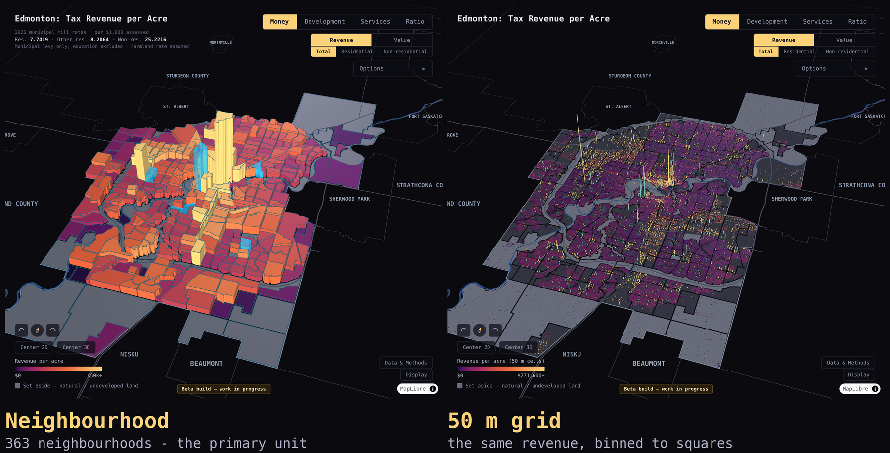

# Edmonton Revenue Per Acre Analysis

**Which parts of Edmonton pay for themselves — mapped, per acre, from open data.**

[](https://peterfriedrich.github.io/edmonton-tax-viz/)

*Municipal property-tax revenue per acre, same camera, two resolutions. Height and
colour are revenue per acre; grey is set-aside natural and undeveloped land.*
**[Open the live map →](https://peterfriedrich.github.io/edmonton-tax-viz/)**

## What This Is

Several published studies have examined the fiscal balance of suburban development in Edmonton. A Sustainable Prosperity report found that costs to the city will exceed revenues by **nearly $4 billion over 60 years** across just 17 planned new developments. A 2016 analysis of three new neighbourhoods (Decoteau, Riverview, Horse Hills) found they'll cost **$1.4 billion more** than they'll generate over 50 years.

No comprehensive, public **revenue-per-acre analysis** has been published for Edmonton — the kind of spatial fiscal analysis that presents this data at the neighbourhood level for residents and councillors.

The goal: map Edmonton's property tax revenue and estimated service costs against land area, broken out by area and development pattern — downtown mixed-use and established infill areas alongside suburban greenfield expansion — and present the per-acre figures.

## Why Now

- Edmonton recently raised property taxes by **6.9%**
- Council is actively debating development costs and suburban expansion
- Edmonton has excellent open data infrastructure (~448,000 property assessment records publicly available)
- No comparable public analysis exists for Edmonton — Calgary and Ottawa each have part of it (see Comparable Work), but neither maps revenue against land area

## Methodology

This project is inspired by the **revenue-per-acre** framework developed by [Urban3](https://www.urbanthree.com/) and popularized by [Strong Towns](https://www.strongtowns.org/), adapted for Edmonton's data environment. (Methodological lineage note: Urban3's denominator is parcel acres — this project's **lot-acre** mode; the **ground-acre** default is this project's own robustness-motivated addition. See `docs/FINDINGS_denominator_cardinality.md`.)

**Core calculation:**
```
Municipal levy (or assessed value) ÷ Neighbourhood area = Revenue (value) per acre
```

with a toggleable denominator: **ground acres** (boundary area — robust to record-to-parcel cardinality issues) or **parcel/lot acres** (deduplicated titled lot area — the Urban3-analogous "developable land" view, with a low-parcel-fraction guard). The revenue numerator is the per-account municipal levy computed from assessed value × the class mill rate.

The **cost side** layers service supply and modeled service cost per acre: road network supply, a bylaw-native stormwater charge model, fire-rescue service demand, and a per-connection water/sanitary model — each validated against published figures where possible (`docs/FINDINGS_utility_validation.md`). Modeled figures are labeled *modeled, not billed*.

**Data sources (all open data):**
- [Property Assessment Data](https://data.edmonton.ca/City-Administration/Property-Assessment-Data-Current-Calendar-Year-/q7d6-ambg) (~440,000 records, refreshed weekly, annual roll)
- Neighbourhood boundaries, Zoning Bylaw geometry, road centrelines, fire-rescue events & stations, and property information (lot sizes) — all from the [Edmonton Open Data Portal](https://data.edmonton.ca/)
- Published mill rates and utility tariffs (EPCOR bylaw rates, franchise fee schedules)

**Tooling:** Python only (pandas + geopandas + shapely; deck.gl in the browser) — no GIS desktop software. The full pipeline regenerates from open data in one command and runs weekly in CI.

## The Data Challenge (resolved)

Edmonton transferred parcel-level GIS *boundary* data to AltaLIS in November 2021 — it's no longer freely available. The project resolved this without AltaLIS, GEODE, or FOIP:

1. **Neighbourhood-level aggregation** on the free boundary file is the primary unit — the same resolution as Ottawa's Hemson study and the Halifax cost-of-service research.
2. **Lot areas** (not boundary geometry) turn out to be in the open [Property Information dataset](https://data.edmonton.ca/) (`dkk9-cj3x`), which — with a repeat-aware deduplication heuristic for condo/multi-unit records (`docs/FINDINGS_lot_dedupe.md`) — supports the parcel-acre denominator and a 100 m grid view at near-Urban3 detail.

Work that would genuinely need parcel *geometry* is catalogued in `docs/PARCEL_LEVEL_OPPORTUNITIES.md`.

## Comparable Work

- **Ottawa (2021):** Hemson Consulting analysis found suburban greenfield development runs a **$465/person/year deficit** while high-density infill generates a **$606/person/year surplus** ([CBC, 2021-09-29](https://www.cbc.ca/news/canada/ottawa/urban-expansion-costs-menard-memo-1.6193429)). Councillor Shawn Menard requested and publicized it, and it featured in the Official Plan urban-boundary debate.
- **Lafayette, LA:** Urban3's parcel-level [Cost of Service analysis](https://www.urbanthree.com/case-study/lafayette-la/) compared 2015 capital revenue against the 50-year cost of roads, parcel by parcel — Urban3 describes it as "the first of its kind." The closest published analogue to this project's cost side, though the parcel-level cost-allocation rule itself has not been published.
- **Halifax (2005):** HRM Regional Planning's [Settlement Pattern and Form with Service Cost Analysis](https://luau.utah.gov/wp-content/uploads/Halifax-Settlement-Pattern-Form-Cost-2005.pdf) costed 8 settlement patterns and found road costs of **$1,053/household/year** in the lowest-density pattern (rural commutershed, 1.2 people/acre) against **$26** in the highest (urban high density, 92 people/acre) — a **40:1 ratio**. Across *all* services the same table spans $5,240 to $1,416, about 3.7:1, so roads are by far the most density-sensitive line in it.
- **Arlington, VA (Rosslyn–Ballston corridor):** the transit-oriented corridor "generated **33 percent of the county tax base** on only **8 percent of its land**" ([CNU](https://www.cnu.org/what-we-do/build-great-places/rosslyn-ballston-corridor)) — a revenue-side example at scale.
- **Calgary ([Calgary Lens](https://calgarylens.ca/property-taxes/by-community)):** an independent civic-data project (Pixeltree) mapping **total property tax by community** across Calgary's 313 communities, computed the same way as here — parcel assessed values × mill rates — from the 2026 roll. The nearest thing in form to this project, and the sharpest contrast in substance: it reports **raw dollar totals with no land-area denominator**, and includes the provincial education portion this project excludes. Revenue only; no cost side.

## Status

**Live:** interactive 3D map at **https://peterfriedrich.github.io/edmonton-tax-viz/**
— municipal tax revenue (and assessed value) per acre by neighbourhood, with a
land-use set-aside layer and a residential-only lens. The public build carries
four lenses: **Money**, **Development** (new dwelling units and permits per acre,
with a per-year history for each neighbourhood), **Services** (the road network
and its modelled cost) and **Ratio** (revenue per road metre).

**Data-quality reports:** **https://peterfriedrich.github.io/edmonton-tax-viz/notebooks/**
— standalone, reproducible findings about defects in Edmonton's published open
data, each recomputing every figure at run time and asserting its own
invariants:

- [The current assessment roll is published under the wrong coverage year](https://peterfriedrich.github.io/edmonton-tax-viz/notebooks/roll-year-metadata.html)
  — `q7d6-ambg`'s `Period of Coverage` says 2025; the rows are the 2026 roll.
- [Whole buildings are missing from the 2024 slice of the Historical roll](https://peterfriedrich.github.io/edmonton-tax-viz/notebooks/historical-2024-gap.html)
  — 2,448 accounts across 188 neighbourhoods, 29 addresses losing every account.
- [What public data can and cannot say about tax-exempt property](https://peterfriedrich.github.io/edmonton-tax-viz/notebooks/exemption-uncertainty.html)
  — sizing a ~$15B gap, and why public data cannot resolve it.
- [Edmonton's open data covers two school authorities, not all of them](https://peterfriedrich.github.io/edmonton-tax-viz/notebooks/school-coverage-gap.html)

Sources are under `notebooks/standalone/`; the register of known issues and
whether anyone has been told is `docs/DATA_ISSUES.md`.

**Full / specialist build:** **https://peterfriedrich.github.io/edmonton-tax-viz/full/**
— the same map with additional specialist controls (Infill mode, Industrial
metric, deeper data-detail) exposed. This is the build for anyone visiting the
repo directly; the public root above is the streamlined view.

The **cost side is
built** (`docs/SPEC_services.md`, `docs/SPEC_utilities.md`): a Services view
layers the city-maintained road network (road supply per acre), a **modeled
stormwater charge** per acre, **fire-rescue service demand** per acre, and a
**modeled water/sanitary charge** per acre; a Ratio view shows **revenue per
road metre** — how much municipal revenue backs each metre of neighbourhood
road. A Uses view maps the zoning bylaw's land-use categories, and a Glass
view renders the metric in **100 m or 50 m grid cells** (the Urban3-style
detail level — the 50 m grid is the resolution at which single high-value
parcels stop being averaged into their neighbours, and is the right-hand panel
of the image above). Both the Money and Glass views toggle between ground acres and
**parcel (lot) acres** as the denominator. A weekly GitHub Action regenerates
the data and redeploys automatically (see `docs/SPEC_deployment.md`).

## Technical Docs

- [`docs/METHODS.md`](docs/METHODS.md) — how the numbers are made: metric definitions, denominators, models, validation, limitations
- [`docs/VERIFICATION.md`](docs/VERIFICATION.md) — how to check the pipeline actually ran correctly, not just read about how it's supposed to work
- [`CONTRIBUTING.md`](CONTRIBUTING.md) — dev pipeline, setup, coding conventions, AI-assisted workflow
- [`docs/ARCHITECTURE.md`](docs/ARCHITECTURE.md) — module contracts and data flow
- [`docs/SPEC_phase1.md`](docs/SPEC_phase1.md) — Phase 1 deliverable and acceptance criteria

## Licence

Fork it. Three different things live here and they are licensed differently:

| What | Licence |
|---|---|
| Code — `src/`, `scripts/`, `tools/`, `web/index.html`, tests, CI | [MIT](LICENSE) |
| Written analysis — `docs/`, `session-summary/`, `data/DATA.md`, `CONTRIBUTING.md`, this README | [CC BY 4.0](LICENSE-docs) |
| Data — `data/`, `web/data/` | Not mine to license — see below |
| Vendored libraries — `web/vendor/` | Their own upstream licences |

The data is derived from public open-government releases and stays under its
upstream terms: the **Open Government Licence – City of Edmonton**, the **Open
Government Licence – Alberta**, and **ODbL** for OpenStreetMap highway
geometry. Both OGLs permit redistribution of derived work with attribution,
which is why it can be committed here — but if you reuse it, the attribution
obligation runs to those publishers directly, not through me.
[`LICENSE`](LICENSE) has the full scope split; [`data/DATA.md`](data/DATA.md)
has per-source provenance.

The analysis is CC BY rather than MIT because a software licence says nothing
useful about a findings document. Credit it and say what you changed.

This is an independent project — not affiliated with, nor endorsed by, the City
of Edmonton.

## Contributing / Contact

This is an independent civic project. If you work in urban planning, municipal finance, or GIS and want to collaborate — or if you have access to data that could help — get in touch.

For code contributions, see [`CONTRIBUTING.md`](CONTRIBUTING.md).
